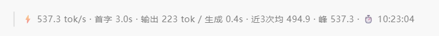

# stepfun-usage-monitor — ZCode Token Rate Monitor (zcode-tps-monitor)

[](LICENSE)


**V2.0.0**: a complete rewrite. This repository is no longer the v1.x "StepFun API token-usage local proxy"; it is now the **ZCode session-level token rate monitor** rebuilt after [shy3130/zcode-tps-monitor](https://github.com/shy3130/zcode-tps-monitor): at the end of every reply it automatically shows the **instant tok/s of the current turn** — read directly from the ZCode usage database, not model self-reporting, not estimation. It also ships a real-time dashboard, slash commands, MCP tools, and optional business-TPS monitoring. **Zero npm dependencies, pure Node, all data stays local.**

> **Upgrading from v1.x**: v1.x (≤ 1.5.11) counted API usage through a local reverse proxy and required pointing your client's Base URL at `127.0.0.1:8787`. V2.0.0 drops the proxy architecture and reads ZCode's own usage database directly — **no client configuration changes, install and go**. The v1.x code remains in git history (tag `v1.5.10` and earlier commits).

> **[中文 README](README.md)** · This is the English version.

This repository doubles as a ZCode local plugin marketplace (marketplace name: `tps-local-marketplace`); the plugin itself lives in [`plugins/zcode-tps-monitor/`](plugins/zcode-tps-monitor/README.md). Full bilingual release notes are in [`docs/releases/`](docs/releases/).

## Architecture

```
┌──────────────────────────────────────────────────────────────┐
│  ZCode client                                                │
│                                                              │
│  SessionStart hook ──▶ record session ID + usage hint         │
│  UserPromptSubmit hook ─▶ read usage DB, inject prev-turn rate│
│  Stop hook ──▶ scope the turn by turn_id, compute rate        │
│                    │                                         │
│                    ▼  rendered directly via systemMessage     │
│         「537.3 tok/s · TTFT 3.0s · output 223 tok …」         │
└───────────────────────┬──────────────────────────────────────┘
                        │ read-only
                        ▼
              ~/.zcode/cli/db/db.sqlite (model_usage table)
                        │
        ┌───────────────┼────────────────┐
        ▼               ▼                ▼
  /tps · /tps-doctor   Live dashboard   MCP tools
  (slash commands)   dashboard/       tps_snapshot
                     server.mjs       tps_watch
```

- **Real data**: the token rate comes entirely from real token accumulations in the ZCode usage database (output-side counting, including thinking tokens) — no model relay, no estimation.
- **Zero dependencies**: Node built-ins only (`node:sqlite` / `node:http`); each hook run is a single millisecond-scale database read.
- **Fully local**: no network, no uploads, no resident background process (the dashboard auto-exits after 3 idle hours).

## Features

- **Instant current-turn rate line (on by default)** — the moment a reply ends (Stop hook), one line is shown automatically: instant tok/s for the turn, time to first token (TTFT), output tokens, pure generation time, request segments / per-segment peak, recent sliding average, session cumulative output, and sampling time. Multi-segment turns (tool calls) are weighted by "total output / total pure generation time", excluding inter-segment tool waits.
- **Real-time dashboard** — `/dashboard` opens a dark ops-style browser panel that refreshes every second; auto-exits after 3 idle hours, leaving no background process.
- **Slash commands** — `/tps` for an instant snapshot; `/tps 10` to sample for 10 seconds (2–30); `/tps-doctor` for environment self-checks.
- **MCP tools** — `tps_snapshot` / `tps_watch` for programmatic access by agents.
- **Desktop overlay (Windows)** — `overlay.ps1` keeps the current rate visible as a resident text overlay.
- **Business TPS monitoring (optional)** — configure `metrics_url` to point at a real metrics endpoint (field names auto-matched across up to three nesting levels); built-in demo data is used when unconfigured. Independent of the token rate.

## Preview

One line of rate metrics is shown automatically when each reply ends — no manual action needed:



| Field | Meaning |
|---|---|
| `537.3 tok/s` | Instant output rate for the turn (incl. thinking tokens; weighted for multi-segment turns) |
| `TTFT 3.0s` | Time to first token (first segment of the turn) |
| `output 223 tok / gen 0.4s` | Output tokens and pure generation time (excluding inter-segment tool waits) |
| `2 seg / peak 537.3` | Request segments in the turn and per-segment peak rate (multi-segment turns only) |
| `avg3 494.9` | Sliding average of the last few turns |
| `total 51.3k tok` | Cumulative output of the current session (independent counter) |
| `⏱ 10:23:04` | Sampling moment (reply end time) |

Number formatting: per-turn "output" uses exact thousands-separated numbers (e.g. `2,762 tok`); "total" uses compact units — raw below 1k, one decimal for 1k–10k (`9.8k`), rounded for 10k–1M (`51k`), one decimal M above 1M (`73.8M`).

## Installation (three ways, pick one)

Requires **Node.js ≥ 22.5** (for the built-in `node:sqlite`; same on Windows / macOS / Linux).

### Option 1: add the marketplace from GitHub (recommended)

In ZCode, run:

```text
/plugin marketplace add Neriah-Ado/stepfun-usage-monitor
/plugin install zcode-tps-monitor@tps-local-marketplace
```

After installing, **restart the session** so the hooks re-register; every reply then ends with the rate line.

### Option 2: local directory

Clone this repository, then in ZCode open **Settings → Plugin Management → Discover → +**, choose "Local directory" as the source, and point it at the repository root.

### Option 3: scripts / dashboard only (no plugin install)

```bash
git clone https://github.com/Neriah-Ado/stepfun-usage-monitor.git
cd stepfun-usage-monitor/plugins/zcode-tps-monitor

node scripts/token-rate.mjs            # current rate (human-readable)
node scripts/token-rate.mjs --turn     # instant rate of the just-finished turn
node scripts/token-rate.mjs --json     # JSON output
node scripts/doctor.mjs                # environment self-check
node dashboard/server.mjs              # live dashboard (default 127.0.0.1:7423)
```

### Updating

```text
/plugin marketplace update tps-local-marketplace
```

Reinstall/upgrade the plugin afterwards and restart the session so the hooks re-register.

## Usage

| Scenario | Action |
|---|---|
| Per-turn rate | Nothing to do — shown automatically when each reply ends |
| Instant snapshot | Type `/tps`; or `/tps 10` to sample for 10 seconds |
| Open the dashboard | Type `/dashboard`, or run `node dashboard/server.mjs` |
| Environment self-check | Rate line missing? Type `/tps-doctor` |
| Disable the current-turn line | Write `{"stopHookLine": false}` to `~/.zcode/tps-monitor.config.json`, restart the session |
| Disable all rate injection | Write `{"tokenRateLine": false}` to the same file, restart the session |
| Desktop overlay | Run `dashboard/overlay.ps1` (Windows) |
| Programmatic access | MCP tools `tps_snapshot` / `tps_watch` |

Plugin-prefixed equivalents: `/zcode-tps-monitor:tps`, `/zcode-tps-monitor:tps-doctor`, `/zcode-tps-monitor:dashboard`.

## Configuration

### Business TPS (optional)

Demo data is used by default; to monitor real business throughput, configure `metrics_url` under **Settings → Plugin Management → zcode-tps-monitor**, pointing at any endpoint that returns JSON. Field names are auto-matched (up to three nesting levels):

| Metric | Recognized field names |
|---|---|
| Throughput | `tps` / `qps` / `throughput` / `transactionsPerSecond` |
| Latency | `p50` / `p95` / `p99` (or `latency_p50`, etc.) |
| Error rate | `error_rate` / `errorRate` / `err_rate` |

Example response:

```json
{"data":{"tps":1240,"p50":11,"p95":28,"p99":46,"error_rate":0.05}}
```

> Note: when `metrics_url` is unset, the plugin's MCP server may fail to start in some clients because the manifest variable cannot be expanded (surfacing as `plugin_variable_missing: metrics_url` from `plugins validate`). Putting any value (even an empty string) in the plugin settings is enough; hooks, commands and the skill are unaffected.

### Environment variables and config files

| Item | Description |
|---|---|
| `ZCODE_USAGE_DB` | Override the usage database path (default `~/.zcode/cli/db/db.sqlite`) for non-standard installs |
| `~/.zcode/tps-monitor.config.json` | Local config: `stopHookLine` (Stop-hook rate line switch), `tokenRateLine` (master rate-injection switch) |
| Dashboard port | `dashboard/server.mjs` listens on `127.0.0.1:7423` by default |

## How it works

```
user sends a message
   │
   ▼
UserPromptSubmit hook
   │  reads the ZCode usage database, injects the previous turn's rate as model context
   ▼
model replies (tool calls × N segments)
   │
   ▼
Stop hook (reply just ended, turn fully recorded)
   │  scopes all requests of the turn by the latest turn_id,
   │  computes the instant rate (total output / total pure generation time)
   ▼
systemMessage renders the turn's rate line directly
```

- **SessionStart hook**: records the current session ID and injects a usage hint.
- **UserPromptSubmit hook**: runs once per turn with a millisecond-scale database read; the current turn hasn't happened yet, so only the previous turn's data is injected as pure model context (never to be quoted back).
- **Stop hook**: fires the instant the reply ends and the turn's data is fully recorded, scoping the turn precisely by `turn_id` (all requests triggered by one user message, including multi-segment tool calls), rendered directly by the client via `systemMessage` — no model relay, zero lag by construction.
- Token rate and business TPS are independent: the former always comes from real ZCode data, the latter depends on whether `metrics_url` is configured.

## Repository layout

```
marketplace.json                      Marketplace manifest (tps-local-marketplace → plugins/zcode-tps-monitor)
plugins/zcode-tps-monitor/
├─ .zcode-plugin/plugin.json          Plugin manifest (V2.0.0, incl. userConfig.metrics_url)
├─ .claude-plugin/plugin.json         Claude-compatible manifest (same version)
├─ .mcp.json                          stdio MCP server definition (tps_snapshot / tps_watch)
├─ commands/                          /tps · /tps-doctor · /dashboard
├─ skills/zcode-tps-monitor/SKILL.md  Skill: auto-triggers on rate/TPS questions
├─ hooks/
│  ├─ hooks.json                      SessionStart / UserPromptSubmit / Stop registration
│  ├─ session-start.mjs               Session hint
│  ├─ prompt-submit.mjs               Previous-turn rate as model context
│  └─ stop.mjs                        Current-turn instant rate line
├─ scripts/
│  ├─ collect.mjs                     Business TPS collection (--watch N to sample)
│  ├─ token-rate.mjs                  Token rate CLI (--turn / --json)
│  ├─ doctor.mjs                      Environment self-check (--json for programmatic use)
│  └─ lib/collect-core.mjs            Collection & formatting core (shared by MCP and scripts)
├─ dashboard/
│  ├─ server.mjs                      Live dashboard server (default 127.0.0.1:7423, auto-exits after 3 idle hours)
│  ├─ index.html                      Dashboard page (refreshes every second)
│  └─ overlay.ps1                     Windows desktop overlay
└─ docs/effect-token-rate.png         Rate-line effect image

test/token-rate.test.mjs              Test suite (node --test)
docs/releases/                        Bilingual release notes per version (Chinese + English)
assets/                               Repository icon (regenerate with node assets/generate-icon.mjs)
```

## Testing and verification

```bash
node --test                                              # test suite (number formatting / turn queries, etc.)
cd plugins/zcode-tps-monitor && node scripts/doctor.mjs  # environment self-check
```

Manual MCP smoke test (responses are `Content-Length` frames; bare JSON-line requests are also accepted):

```bash
printf '%s\n' \
  '{"jsonrpc":"2.0","id":1,"method":"initialize","params":{"protocolVersion":"2024-11-05","capabilities":{},"clientInfo":{"name":"manual","version":"0"}}}' \
  '{"jsonrpc":"2.0","id":2,"method":"tools/list"}' \
  | node plugins/zcode-tps-monitor/mcp/tps-server.mjs
```

## FAQ

**Q: Can I use it in OpenCode / Codex / Claude Code or other tools?**

A: The plugin mechanism, hooks and data source are all ZCode-specific, so the token rate feature only works in ZCode; the business-TPS collector and dashboard are standalone programs that can run without ZCode, but without ZCode there is no rate data source.

**Q: Is the displayed rate accurate?**

A: The rate is computed from real token accumulations in the ZCode usage database, counting model output tokens (including thinking tokens). The line is sampled the instant a reply ends and reflects exactly that turn; multi-segment turns are weighted by "total output / total pure generation time", excluding inter-segment tool waits. Numbers may differ slightly from other tools due to different counting windows.

**Q: The rate line suddenly disappeared?**

A: Run `/tps-doctor`. Common causes: Node below 22.5 (needs the built-in `node:sqlite`), a table-structure change after a ZCode update, a session not restarted after a plugin upgrade (hooks register on new sessions), or injection disabled in the config file.

**Q: macOS / Linux support?**

A: Yes. Hooks, commands, dashboard and MCP are all cross-platform Node implementations; the usage database path is resolved from the user home directory, and non-standard installs can override it with the `ZCODE_USAGE_DB` environment variable. The only exception is the desktop overlay `overlay.ps1`, which depends on Windows APIs and is Windows-only (macOS users can use the dashboard instead).

**Q: What's the relationship with the v1.x stepfun-usage-monitor?**

A: Two generations of the same repository. v1.x counted LLM API token usage through a local reverse proxy (`127.0.0.1:8787`) and required changing the client Base URL; V2.0.0 is a complete rewrite as a ZCode plugin that reads ZCode's own usage database with no client configuration changes. If you still need the v1.x proxy, the code is in git history (see tag `v1.5.10`).

**Q: How do I turn off the demo data?**

A: Demo data only affects the "business TPS" part (the token rate is always real); leaving `metrics_url` unconfigured is demo mode, and configuring it switches to the real data source automatically.

## License

[MIT](LICENSE) © 2026 shy3130 (upstream author) · V2.0.0 rewrite: Neriah-Ado
